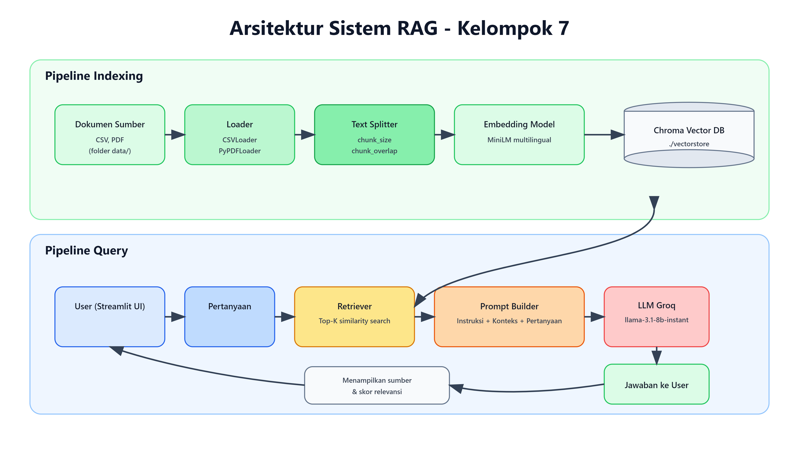

# 🤖 RAG — UTS Data Engineering

> **Retrieval-Augmented Generation** — Sistem Tanya-Jawab Cerdas Berbasis Dokumen

---

## 👥 Identitas Kelompok

|           Nama            |    NIM    | Tugas Utama     |
|---------------------------|-----------|-----------------|
| Achmad Wildan Miftakhudin | 244311032 | Project Manager |
| Kunni Sofa Rahmayani      | 244311046 | Data Engineer   |
| Rindy Cantika Agustina P  | 244311057 | Data Analyst    |
| Riyan Zakaria Zulkarnain  | 244311058 | Project Manager |

**Topik Domain:** *Pertanian*  
**Stack yang Dipilih:** *LangChain*  
**LLM yang Digunakan:** *Groq*  
**Vector DB yang Digunakan:** *ChromaDB*

---

## 🗂️ Struktur Proyek

```
RAG-uts-Kel7/
├── data/                    # Dokumen sumber Anda (PDF, TXT, dll.)
│   └── Crop_recomendationV2 # Contoh dokumen (ganti dengan dokumen Anda)
├── src/
│   ├── indexing.py          # 🔧 WAJIB DIISI: Pipeline indexing
│   ├── query.py             # 🔧 WAJIB DIISI: Pipeline query & retrieval      
├── ui/
│   └── app.py               # 🔧 WAJIB DIISI: Antarmuka Streamlit
├── docs/
│   └── Arsitektur.png       # 📌 Diagram arsitektur (buat sendiri)
├── evaluation/
│   └── hasil evaluasi.xlsx  # 📌 Tabel evaluasi 10 pertanyaan
├── .env.example             # Template environment variables
├── .gitignore
├── requirements.txt
└── README.md
```

---

## ⚡ Cara Memulai (Quickstart)

### 1. Clone & Setup

```bash
# Clone repository ini
git clone https://github.com/wya-and7/RAG-uts-Kel7.git
cd RAG-uts-Kel7

# Buat virtual environment
python -m venv venv
source venv/bin/activate        # Linux/Mac
# atau: venv\Scripts\activate   # Windows

# Install dependencies
pip install -r requirements.txt
```

### 2. Konfigurasi API Key

```bash
# Salin template env
cp .env.example .env

# Edit .env dan isi API key Anda
# JANGAN commit file .env ke GitHub!
```

### 3. Siapkan Dokumen

Letakkan dokumen sumber Anda di folder `data/`:
```bash
# Contoh: salin PDF atau TXT ke folder data
cp dokumen-saya.pdf data/
```

### 4. Jalankan Indexing (sekali saja)

```bash
python src/indexing.py
```

### 5. Jalankan Sistem RAG

```bash
# Dengan Streamlit UI
streamlit run ui/app.py

# Atau via CLI
python src/query.py
```

---

## 🔧 Konfigurasi

Semua konfigurasi utama ada di `src/config.py` (atau langsung di setiap file):

| Parameter | Default | Keterangan |
|-----------|---------|------------|
| `CHUNK_SIZE` | 500 | Ukuran setiap chunk teks (karakter) |
| `CHUNK_OVERLAP` | 50 | Overlap antar chunk |
| `TOP_K` | 3 | Jumlah dokumen relevan yang diambil |
| `MODEL_NAME` | *llama-3.1-8b-instant* | Nama model LLM yang digunakan |

---

## 📊 Hasil Evaluasi

*Evaluasi Pertanyaan ada di evaluation/Hasil Evaluasi.csv*

**Rata-rata Skor:** 3.9  
**Analisis:** sistem sudah stabil untuk pertanyaan konseptual, tetapi perlu peningkatan pada presisi data kuantitatif dan strategi fallback ketika dokumen tidak memuat jawaban eksplisit.

---

## 🏗️ Arsitektur Sistem



```
[Dokumen] → [Loader] → [Splitter] → [Embedding] → [Vector DB]
                                                    ↕
[User Query] → [Query Embed] → [Retriever] ---→ [Prompt] → [LLM] → [Jawaban]
```

---

## 📚 Referensi & Sumber

- Framework: *(LangChain docs / LlamaIndex docs)*
- LLM: *Groq*
- Vector DB: *ChromaDB*

---

## 👨‍🏫 Informasi UTS

- **Mata Kuliah:** Data Engineering
- **Program Studi:** D4 Teknologi Rekayasa Perangkat Lunak
- **Deadline:** *(isi tanggal)*
